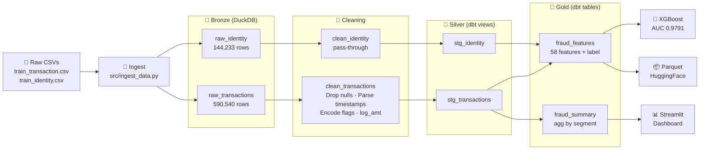

# Data Pipeline Architecture

> **This document describes the data pipeline independently of the ML model.**  
> The pipeline is the product. The model is proof it works.

This pipeline transforms raw financial transaction logs into a clean, labeled, model-ready feature dataset. It is designed to be **replicated for any fintech use case**: fraud detection, credit scoring, AML, or chargeback prediction.

---

## Architecture Diagram



---

## Pipeline Stages

### Stage 1 — Ingestion (`src/ingest_data.py`)

**Input:** Raw CSV files (transactions + identity records)  
**Output:** DuckDB tables — `raw_transactions`, `raw_identity`  
**Engine:** DuckDB `read_csv_auto` (columnar, in-process, no server required)

What happens:
- Loads 590,540 transaction rows and 144,233 identity rows into DuckDB
- Auto-detects schema and column types
- Drops columns with >90% null values (configurable threshold)
- Preserves mandatory signal columns regardless of null rate

**Why DuckDB:** Processes 600K+ rows in under 30 seconds on a laptop. No database server, no infrastructure — just a file. Trivially portable to S3-backed DuckDB or MotherDuck for cloud scale.

---

### Stage 2 — Cleaning (`src/ingest_data.py` → `clean_transactions`)

Applied during ingestion before dbt sees the data:

| Transformation | Logic |
|----------------|-------|
| Timestamp parsing | `TransactionDT` (seconds offset) → real UTC timestamp using known epoch anchor |
| Temporal features | `hour_of_day`, `day_of_week` extracted from parsed timestamp |
| Log transform | `log_amt = ln(TransactionAmt + 1)` to normalize right-skewed distribution |
| Identity join flag | `has_identity` = 1 if a device record exists for the transaction |
| M-flag encoding | String flags (T/F/M0/M1/M2) → integers (1/0/0/1/2) |
| Column pruning | Drops high-null columns (>90%) not in mandatory set |

---

### Stage 3 — Transformation (dbt, `dbt_project/`)

Follows a **Medallion Architecture** pattern:

```
Bronze (raw_*)  →  Silver (stg_*)  →  Gold (marts/*)
```

#### Staging Layer (Silver) — `dbt_project/models/staging/`

| Model | Source | Purpose |
|-------|--------|---------|
| `stg_transactions` | `clean_transactions` | Renames to snake_case, selects signal columns |
| `stg_identity` | `clean_identity` | Exposes device/browser identity features |

Materialized as **views** — no storage cost, always fresh.

#### Marts Layer (Gold) — `dbt_project/models/marts/`

| Model | Purpose |
|-------|---------|
| `fraud_features` | Main feature table: joined transactions + identity + all engineered features |
| `fraud_summary` | Pre-aggregated risk metrics by product, card type, email domain, hour |

Materialized as **tables** — optimized for ML training and dashboard queries.

---

### Stage 4 — Feature Engineering (`fraud_features` mart)

All features computed in SQL via dbt CTEs:

#### Velocity Features (Card-level)
```sql
card1_txn_count          -- transaction count per card number
card1_avg_amt            -- historical average amount per card
card1_historical_fraud_rate  -- prior fraud rate per card
```

#### Risk Features (Email domain)
```sql
email_txn_count              -- transaction count per email domain
email_historical_fraud_rate  -- prior fraud rate per email domain
```

#### Ratio Features
```sql
amt_vs_card_avg_ratio    -- current amount / card's historical average
                         -- flags unusual spend patterns
```

#### Binary Flags
```sql
is_high_risk_product     -- 1 if product_cd = 'W' (highest fraud rate segment)
has_identity             -- 1 if device fingerprint record exists
```

---

> **⚠️ Production Note — Point-in-Time Correctness**
>
> The `card1_historical_fraud_rate` and `email_historical_fraud_rate` features are computed across the **entire dataset** in a single aggregation. In a batch proof-of-work context this is acceptable and produces valid model performance metrics.
>
> In a **production streaming pipeline**, these aggregations must be computed using only data available *at the time of each transaction* — i.e., a windowed or point-in-time join — to avoid temporal data leakage. Implementation approaches include:
> - **DuckDB window functions**: `AVG(is_fraud) OVER (PARTITION BY card1 ORDER BY transaction_dt ROWS BETWEEN UNBOUNDED PRECEDING AND 1 PRECEDING)`
> - **Feature store**: Pre-materialise rolling aggregates keyed by entity + timestamp
> - **Incremental dbt model**: Recompute stats only on new data batches
>
> This distinction is documented here for teams adapting this pipeline for real-time fraud scoring.

---

### Stage 5 — Delivery Formats

The `fraud_features` table is the delivery artifact. It can be exported as:

| Format | Command |
|--------|---------|
| Parquet | `COPY fraud_features TO 'output.parquet' (FORMAT PARQUET)` |
| CSV | `COPY fraud_features TO 'output.csv' (HEADER)` |
| JSONL | `COPY fraud_features TO 'output.jsonl' (FORMAT JSON)` |
| HuggingFace Dataset | See `notebooks/03_model_eval.ipynb` export section |

---

## Schema: `fraud_features`

| Column | Type | Description |
|--------|------|-------------|
| `transaction_id` | INTEGER | Primary key |
| `transaction_dt` | INTEGER | Seconds offset (raw) |
| `transaction_ts` | TIMESTAMP | Parsed UTC timestamp |
| `transaction_amt` | DOUBLE | Transaction amount ($) |
| `log_amt` | DOUBLE | ln(amount + 1) |
| `hour_of_day` | INTEGER | 0–23 |
| `day_of_week` | INTEGER | 0–6 |
| `product_cd` | VARCHAR | W / H / C / S / R |
| `has_identity` | INTEGER | 0 or 1 |
| `is_fraud` | INTEGER | **Label**: 0 = legit, 1 = fraud |
| `card1–card6` | MIXED | Card metadata |
| `addr1, addr2` | DOUBLE | Billing/shipping zip |
| `dist1, dist2` | DOUBLE | Distance features |
| `purchaser_email_domain` | VARCHAR | Purchaser email domain |
| `recipient_email_domain` | VARCHAR | Recipient email domain |
| `C1–C14` | DOUBLE | Counting/behavioral features |
| `D1–D15` | DOUBLE | Time-delta features |
| `M1_enc–M9_enc` | INTEGER | Encoded match flags |
| `id_01–id_20` | DOUBLE | Device/browser identity features |
| `device_type` | VARCHAR | Mobile / desktop |
| `card1_txn_count` | BIGINT | Card velocity |
| `card1_avg_amt` | DOUBLE | Card historical avg amount |
| `card1_historical_fraud_rate` | DOUBLE | Card fraud rate |
| `email_txn_count` | BIGINT | Email domain velocity |
| `email_historical_fraud_rate` | DOUBLE | Email domain fraud rate |
| `is_high_risk_product` | INTEGER | Product risk flag |
| `amt_vs_card_avg_ratio` | DOUBLE | Amount anomaly ratio |

**Total: 58 features + 1 label**

---

## Data Quality Tests (dbt)

All tests run via `dbt test`:

| Test | Column | Assertion |
|------|--------|-----------|
| unique | `transaction_id` | No duplicate transactions |
| not_null | `transaction_id` | Every row has an ID |
| not_null | `is_fraud` | Every row has a label |
| not_null | `transaction_amt` | No unlabeled amounts |
| accepted_values | `is_fraud` | Values in {0, 1} only |
| accepted_values | `product_cd` | Values in {W, H, C, S, R} |

---

## Adapting This Pipeline

This pipeline is designed to be **configurable for different fintech use cases**:

| Parameter | Location | Description |
|-----------|----------|-------------|
| Null threshold | `ingest_data.py` → `THRESHOLD` | Column drop threshold (default 90%) |
| Mandatory columns | `ingest_data.py` → `MANDATORY_COLS` | Columns kept regardless of nulls |
| Epoch anchor | `ingest_data.py` → `BASE_DT_EPOCH` | Timestamp origin for your dataset |
| Velocity grouping | `fraud_features.sql` → `card_stats` | Change `card1` to any entity key |
| Risk dimension | `fraud_summary.sql` | Add/remove aggregation dimensions |
| Delivery format | DuckDB `COPY` statement | Parquet / CSV / JSONL / HuggingFace |

---

## Running the Pipeline

```bash
# Step 1: Ingest raw data into DuckDB
python src/ingest_data.py

# Step 2: Run dbt transformations
cd dbt_project
dbt run        # builds all models
dbt test       # validates data quality

# Step 3: Export (example: Parquet)
# In Python:
import duckdb
con = duckdb.connect('data/fraud.duckdb')
con.execute("COPY fraud_features TO 'fraud_features.parquet' (FORMAT PARQUET)")
```

Full pipeline runtime: **< 4 minutes** on a standard laptop.

---

## Want This for Your Data?

I build custom versions of this pipeline for fintech AI teams — configured to your data sources, schema, and model requirements.

**→ [Connect on LinkedIn](https://linkedin.com/in/kshitijbhatt) to discuss your use case.**
