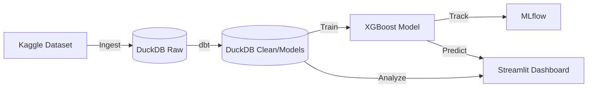

# 🛡️ Fintech Fraud Detection Pipeline

A robust, end-to-end data engineering and machine learning pipeline for detecting fraudulent transactions in fintech workflows. This project leverages modern data tools like **DuckDB**, **dbt**, and **MLflow** to create a scalable and trackable fraud detection system.

---

## 🚀 Overview

The **Fintech Fraud Pipeline** is designed to process high-velocity transaction data, perform complex feature engineering, and deploy predictive models to identify fraudulent patterns. Built with performance and observability in mind, it provides a seamless flow from raw data ingestion to a real-time monitoring dashboard.

### ✨ Key Features
- **⚡ High-Performance Storage**: Uses [DuckDB](https://duckdb.org/) for lightning-fast local analytical processing.
- **🏗️ Structured Transformations**: Leverages [dbt](https://www.getdbt.com/) (Data Build Tool) for modular, version-controlled SQL transformations.
- **🧠 Advanced ML**: Employs [XGBoost](https://xgboost.readthedocs.io/) for high-accuracy fraud prediction.
- **📊 Experiment Tracking**: Integrated with [MLflow](https://mlflow.org/) to track model metrics and parameters.
- **📈 Live Dashboard**: A Streamlit-based interactive dashboard to visualize fraud alerts and model performance.

---

## 📐 Architecture



---

## 🛠️ Tech Stack

| Category | Tools |
| :------- | :---- |
| **Database** | DuckDB |
| **Transform** | dbt-duckdb |
| **ML/AI** | XGBoost, Scikit-learn |
| **Tracking** | MLflow |
| **UI/UX** | Streamlit, Plotly |
| **Language** | Python 3.x |

---

## 📁 Project Structure

```text
├── data/               # Raw and processed datasets (DuckDB)
├── dbt_project/        # dbt models and configurations
├── models/             # Saved ML model artifacts
├── mlruns/             # MLflow experiment logs
├── notebooks/          # Exploratory Data Analysis (EDA)
├── src/
│   ├── ingest_data.py  # Raw data ingestion & initial cleaning
│   ├── train.py        # ML training & evaluation
│   └── dashboard.py    # Streamlit visualization app
└── requirements.txt    # Project dependencies
```

---

## 🏁 Getting Started

### 1. Prerequisites
- Python 3.8+
- [Kaggle API Credentials](https://github.com/Kaggle/kaggle-api)

### 2. Installation
```bash
# Clone the repository
git clone https://github.com/Kshitijbhatt1998/fintech-fraud-pipeline.git
cd fintech-fraud-pipeline

# Create and activate virtual environment
python -m venv .venv
source .venv/bin/activate  # On Windows: .venv\Scripts\activate

# Install dependencies
pip install -r requirements.txt
```

### 3. Data Setup
Download the [IEEE-CIS Fraud Detection](https://www.kaggle.com/c/ieee-fraud-detection) dataset and place the CSVs in `data/raw/`.

---

## ⚙️ Usage

### 📥 Ingestion & Cleaning
Load raw transactions into DuckDB and perform initial preprocessing:
```bash
python src/ingest_data.py
```

### 🏗️ Data Transformation (dbt)
Run dbt models to prepare features for training:
```bash
# Update dbt profiles.yml if necessary
cd dbt_project
dbt build
```

### 🏋️ Model Training
Train the XGBoost model and log results to MLflow:
```bash
python src/train.py
```

### 📊 Monitoring Dashboard
Launch the interactive fraud dashboard:
```bash
streamlit run src/dashboard.py
```

---

## 👤 Author
**Kshitij Bhatt**  
[LinkedIn](https://www.linkedin.com/in/kshitij-bhatt-a5502517b)

---
## 📝 License
Distributed under the MIT License.

---
*Created with ❤️ by Antigravity*
